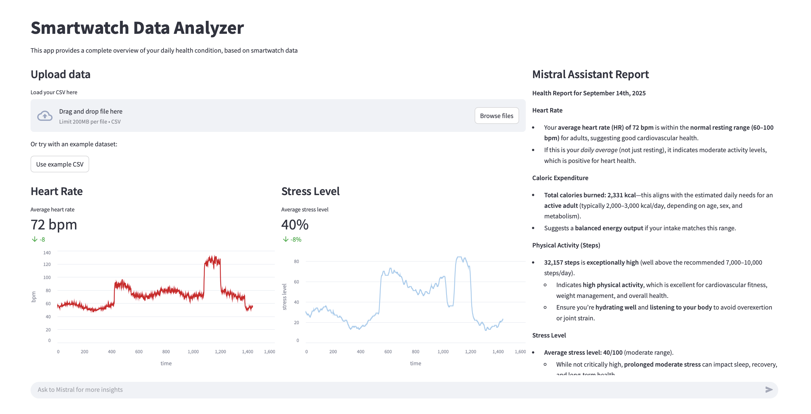

# Smartwatch data analyzer

*A demo application built with **FastAPI**, **Streamlit**, and the **Mistral API** to analyze smartwatch data and provide AI-powered health insights.* 



---

## Features

- Upload smartwatch CSV data or use the built-in **example dataset**  
- Automatic calculation of key health metrics:
  - Heart Rate  
  - Stress Level  
  - Sleep Stages  
  - Physical Activity (steps, calories)  
- AI-powered **Health Report** generated with Mistral models  
- Integrated **Chat Assistant** to ask follow-up questions and receive personalized insights  

## Architecture

The app is organized into two main modules:  

- **Backend (FastAPI)**  
  - Parses smartwatch CSV data  
  - Computes metrics (HR, stress, sleep, calories, steps)  
  - Interacts with Mistral API for natural language analysis  

- **Frontend (Streamlit)**  
  - Provides a clean and interactive UI  
  - Displays metrics and time-series charts  
  - Includes an assistant chat panel for deeper exploration  

## Fast installation

1. Clone the repo:
    ```
    git clone https://github.com/pietroruzzante/mistral-smartwatch.git
    cd mistral-smartwatch
    ```
2. Create a `.env` file with your Mistral API key:
   ```
   MISTRAL_API_KEY=your_api_key_here
   ```
3. Build and run the container
    ```
   docker-compose up --build
    ```
4. Access the app at: http://localhost:3000

The repo includes an example CSV dataset in **data/**.
You can load it directly from the UI using the "Use example CSV" button.

If you want to use your own dataset, it must be a CSV file with: 

---

### Author
Developed by Pietro Ruzzante